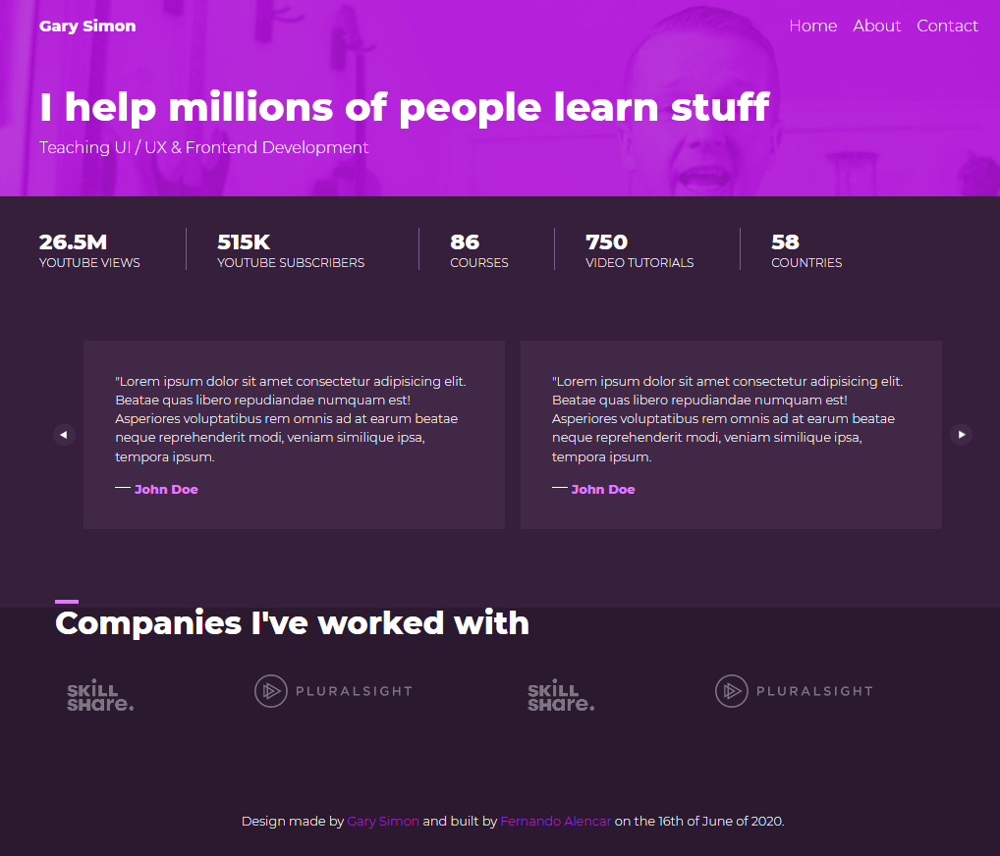

# Gary Design Mockup
> A fully responsive page designed mobile first.

This was a really interesting project with a higher difficulty than I have had before but regardless an awesome learning experience!

 Link of the project on github pages:  
https://falencar-dev.github.io/Design-course-site/

## Technologies Used
This site was built using only HTML and CSS.  
However on the youtube video Gary used SASS, a technology that I didn't get my hands on yet.

## Date of completion
June 16th of 2020
